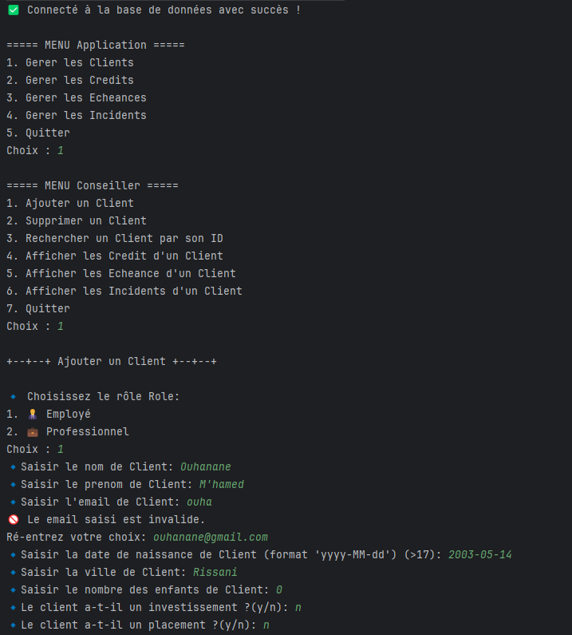
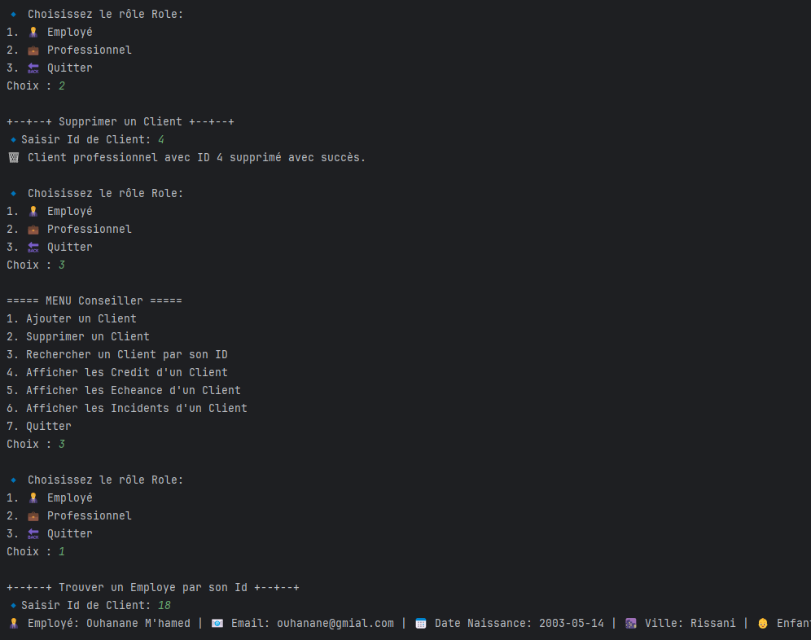
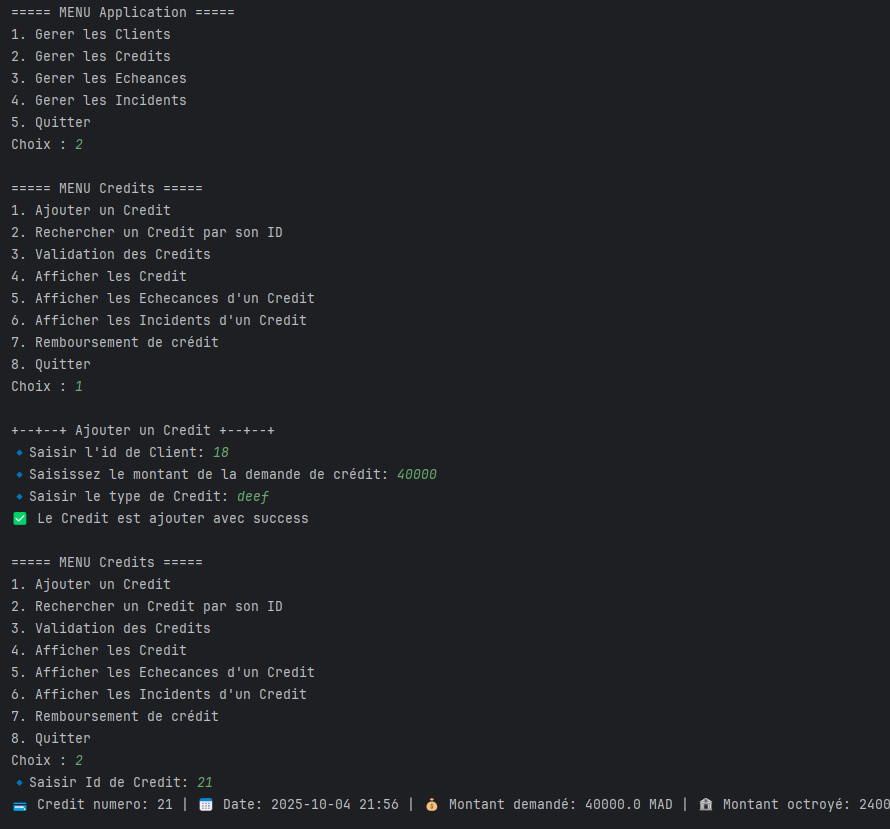
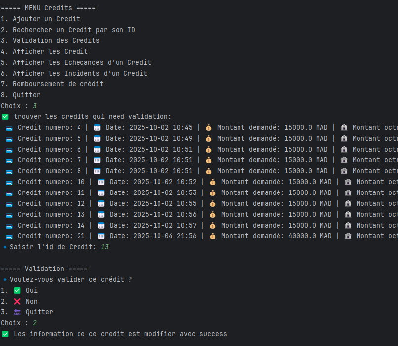
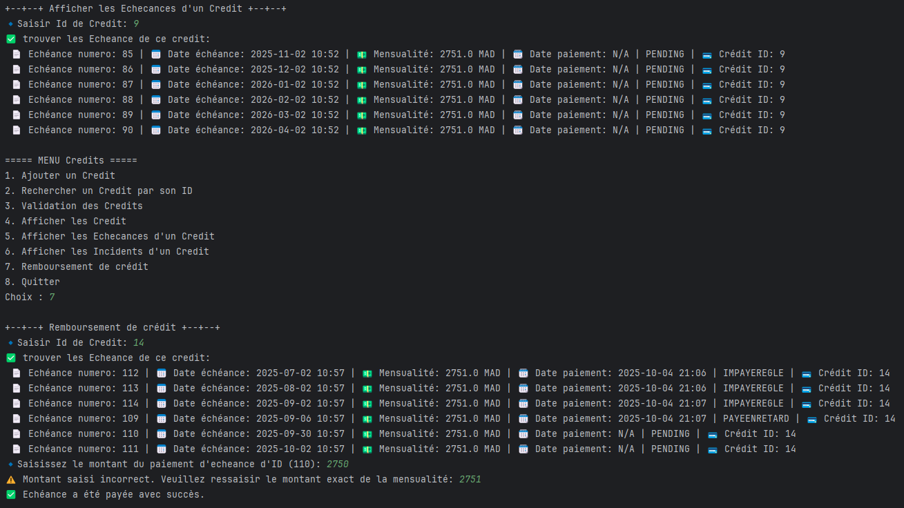
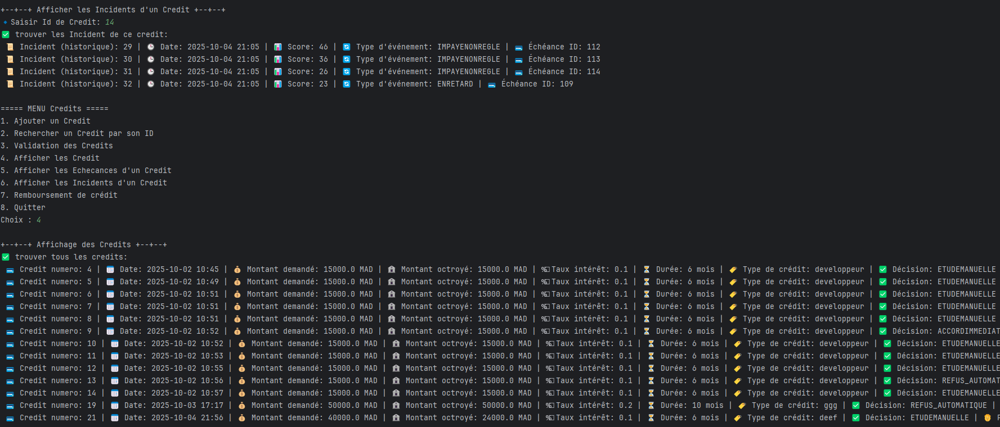

# 💳 Micro-Credit Scoring System

## 📖 Description du projet
Le projet vise à développer un système de scoring automatisé pour le secteur micro-finance marocain afin d’améliorer l’évaluation du risque crédit.  
Le système combine :

- 📊 Algorithmes de scoring basés sur 5 composants métier : stabilité professionnelle, capacité financière, historique, relation client, patrimoine.
- 🤖 Moteur de décision automatique.
- 🗂️ Historisation complète des opérations pour audit.
- 🎯 Optimisation de l’octroi de crédit avec un scoring intelligent réduisant les risques tout en améliorant l’accès au financement.

---

## 🛠️ Technologies utilisées

- Java 8 ☕
- JDBC pour la connexion à la base de données
- Collections Java : `List`, `Map`, `Optional`
- Enums
- Java Time API (`LocalDateTime`)
- Design Patterns : Singleton, Repository Pattern
- Maven/Gradle ou compilation manuelle avec `javac` et `jar`

---

### 🏗️ Couche principale :
- **UI/Menu** : interaction avec l’utilisateur 🖥️
- **Couche métier (service)** : logique métier et calcul de score ⚙️
- **Repository** : gestion des opérations sur la base de données 💾
- **Utils** : validations et outils auxiliaires 🛠️
- **Config** : configuration de la base de données 🔧
- **Controller** : interaction entre la vue et le service 🔄

---

## 📌 Modules et fonctionnalités

### MODULE 1 : Gestion des clients 👥
- Ajouter, modifier, supprimer et consulter les clients
- Lister tous les clients

**Classes principales :**
- `Personne` (abstraite) : nom, prénom, dateNaissance, ville, nombreEnfants, investissement, placement, situationFamiliale, createdAt, score
- `Employe` : salaire, ancienneté, poste, typeContrat, secteur
- `Professionnel` : revenu, immatriculation fiscale, secteur d’activité, activité

### MODULE 2 : Calcul de score 📊
- Algorithme automatique basé sur 5 composants
- Validation des seuils d’éligibilité
- Calcul de la capacité d’emprunt
- `Credit` : dateCredit, montantDemande, montantOctroye, tauxInteret, duree, typeCredit, decision

### MODULE 3 : Gestion de l’historique de paiement 🧾
- Génération automatique des échéances
- Suivi des paiements : à temps ✅, en retard ⏰, impayé ❌
- Gestion des incidents et pénalités/bonus
- `Echeance` : dateEcheance, mensualite, datePaiement, statutPaiement
- `Incident` : dateIncident, echeance, score, typeIncident

### MODULE 4 : Moteur de décision automatique 🤖
- Accord immédiat pour score ≥ 80 ✅
- Étude manuelle pour score intermédiaire 60-79 📝
- Refus automatique pour score < 60 ❌

### MODULE 5 : Analytics 📈
- Recherche clients éligibles selon critères multiples
- Suivi des clients à risque ⚠️
- Tri par score, revenus, ancienneté
- Répartition par type d’emploi
- Analyse pour campagnes marketing ciblées 💌

---

## ⚙️ Prérequis

- JDK 8 ou supérieur installé ☕
- IDE Java IntelliJ IDEA 💻
- Base de données MySQL 🗄️
- Terminal pour exécution du JAR 🖥️

---

## 🖼️ Conception :
- Diagramme de classe :
  .jpg)

## 📸 Captures d’écran :
|               |               |
|--------------------------------------------------|--------------------------------------------------|
|               |               |
|               |               |
|            

---

## ▶️ Exécution
```bash 
java -jar out/artifacts/Scoring_Micro_credit_jar/Scoring_Micro-credit.jar
